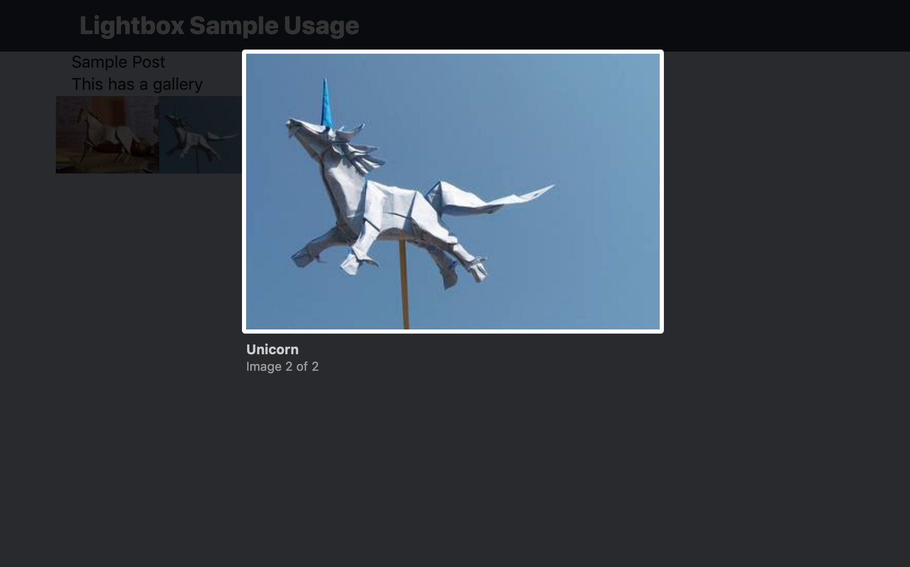
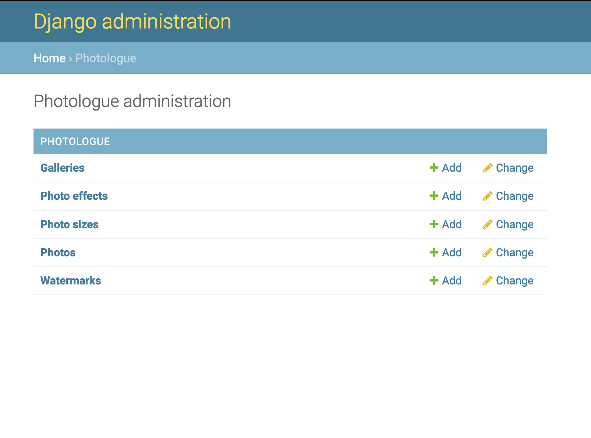

# 🖼️ django-photologue-lightbox2

This is the simpliest and __quickest to set up__ app to show usage of Lightbox with a great Django library for photos and galleries.

### Uses:
- [django-photologue][0]
- [Lightbox 2][1] downloaded from [here][2]

### Installation instructions:

[Installation and instructions][3] on my blog.

### Example at work:

- Template:

- Admin:

[0]: https://django-photologue.readthedocs.io/en/stable/index.html
[1]: https://lokeshdhakar.com/projects/lightbox2/
[2]: https://github.com/lokesh/lightbox2/releases
[3]: https://hvitis.dev/the-best-and-easiest-django-gallery-with-elegant-css